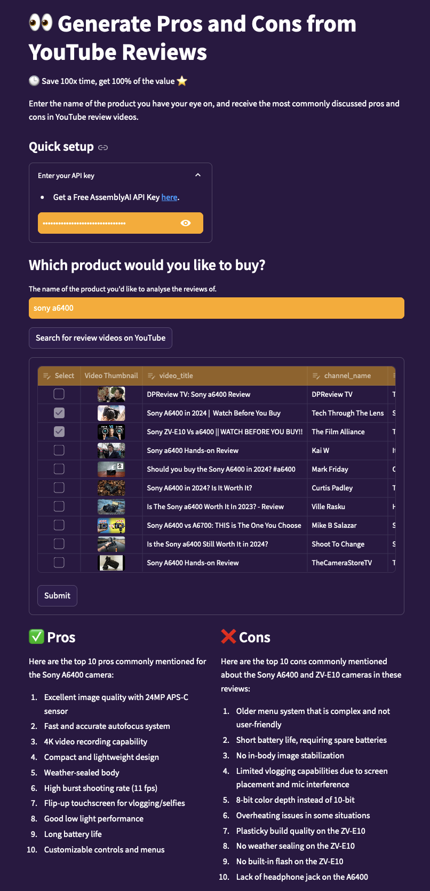

# VidGist - Product Review Summarizer

This is a webapp to extract insights from product review videos on YouTube with a couple of clicks!

👆 Try it here: https://vidgist.onrender.com

P.S.: Due to YouTube blocking the download option, the last step of the app might not always be able to work. If you run it locally, you should be able to get the app running right away.

### To run locally:
1. Clone this repo
2. Paste your own YouTube Data API Key on line 86 of main.py (or save your YT API key as an environment variable)
3. Make sure you have an AssemblyAI account
4. Run the app with "streamlit run main.py"

## 🔑 What you need for this app:
* An AssemblyAI API Key: [get it here](https://www.assemblyai.com/?utm_source=youtube&utm_medium=referral&utm_campaign=yt_mis_69)
* Streamlit
* YouTube Data API Key: [get it here](https://developers.google.com/youtube/v3/getting-started)

🙏 Please report any issues with the app on GitHub. Thank you!
